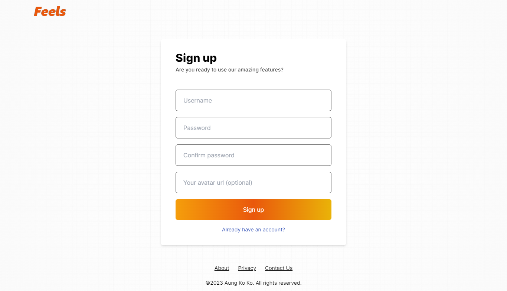
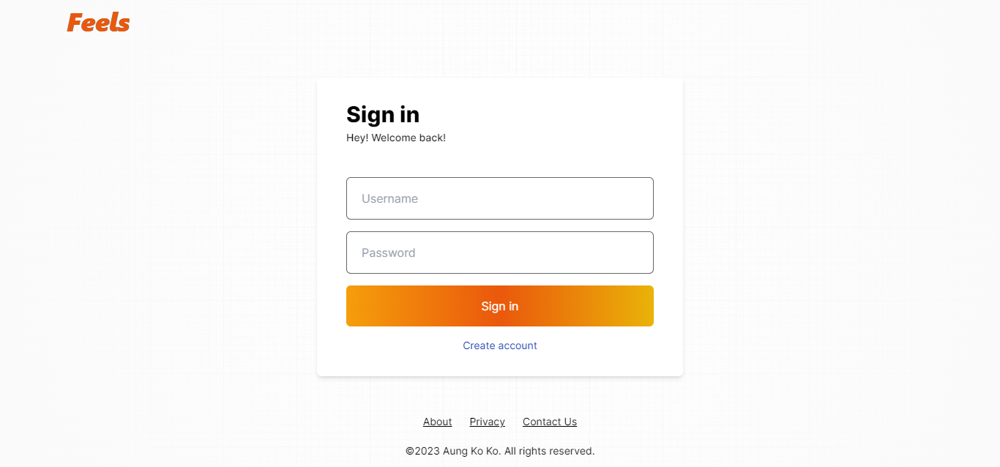
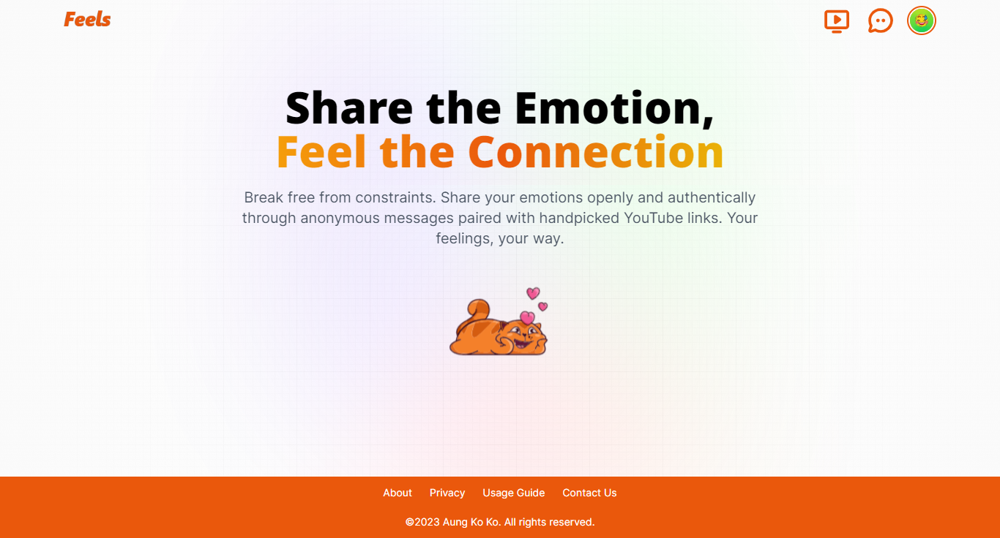
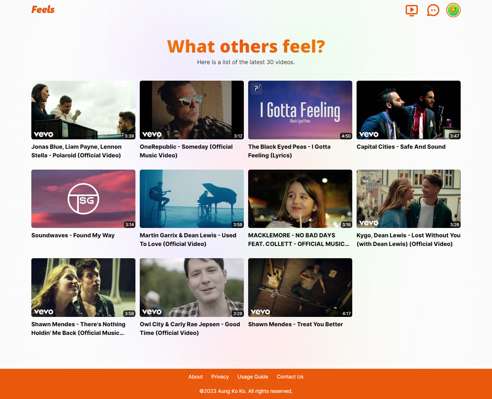
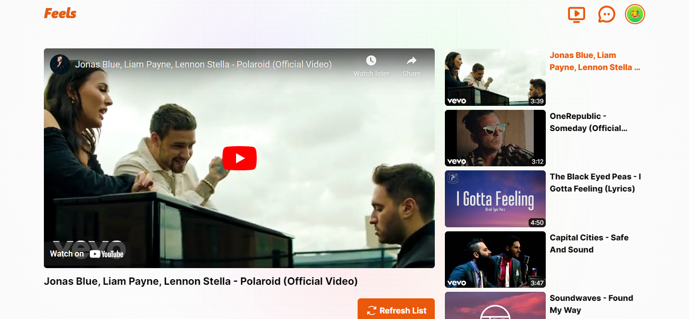
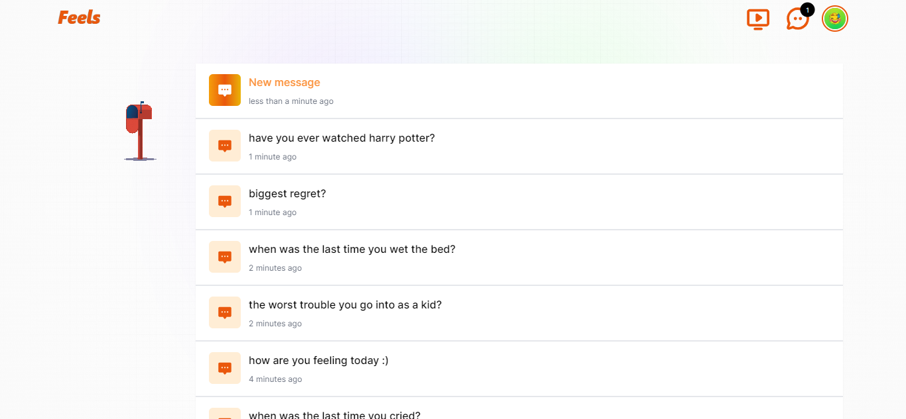
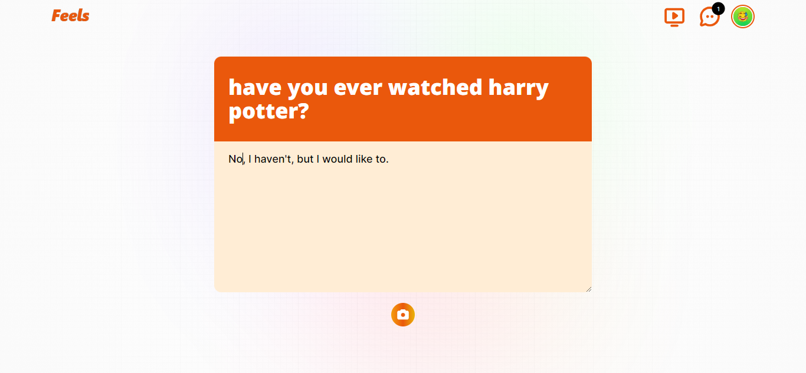
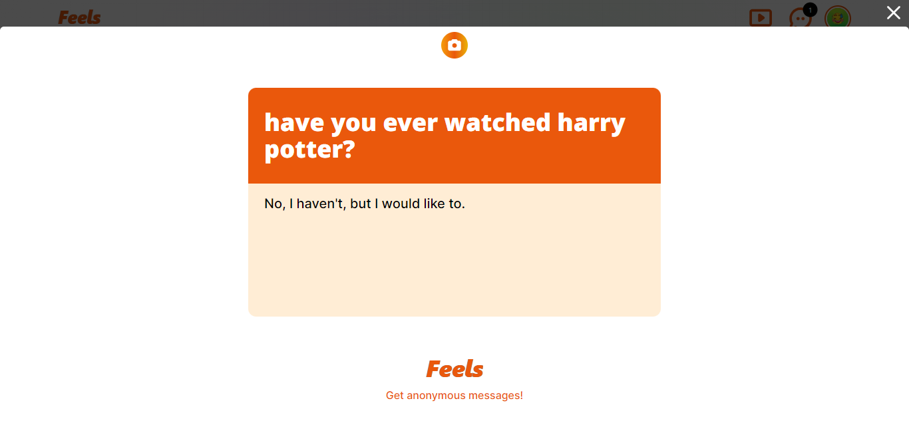
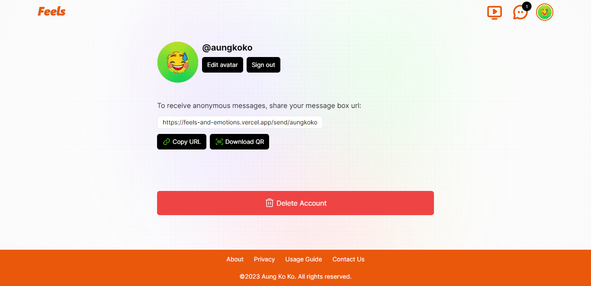
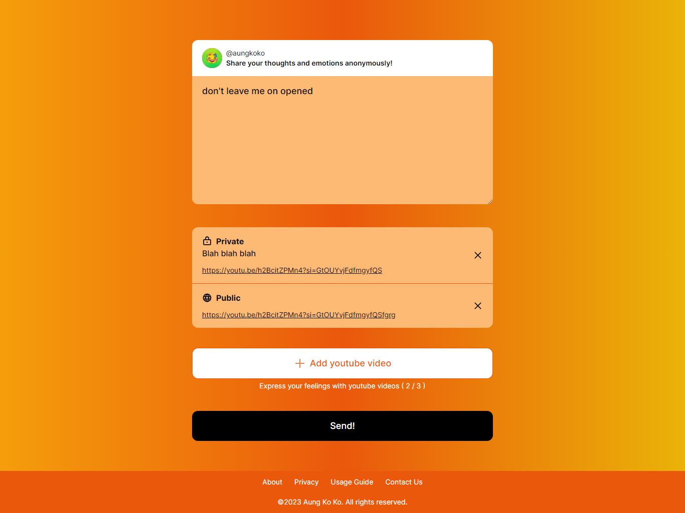

# Feels

An online platform where users can share their emotions anonymously. Similar to [NGL](https://ngl.link/), I go a step further by allowing users to attach a maximum of three YouTube videos along with their messages to easily express their feelings. Moreover, I offer an option to share these YouTube videos publicly, visible only to authenticated users.

## Features

- Authentication / Authorization
- Feed (to entertain users)
- Profile with functions (update avatar, delete account, share link, download QR code)
- Sending anonymous messages optionally attach with maximum three handpicked YouTube links
- Real-time incoming messages
- Able to take images of incoming messages along with your replies
- Message decryption

## Tech Stack

- TypeScript
- Nest.js (for [API](https://github.com/AKK-soft-dev/feels-api))
- Next.js
- React Query
- [Ably](https://ably.com/)
- axios
- next-auth
- html-to-image
- qrcode
- crypto
- react-toastify
- @formkit/auto-animate
- Tailwind CSS
- [others](https://github.com/AKK-soft-dev/feels-api/blob/main/package.json)

## Demo

https://feels-and-emotions.vercel.app/

## Project Images

_Sign Up Page_
 

_Sign In Page_
 

_Home Page_
 

_Feed Page_
 

_Play Video Page_
 

_Real-time Incoming Messages Page_
 

_Message Detail Page_
 

_Generate Image_
 

_Profile Page_
 

_Message Box Page_
 
